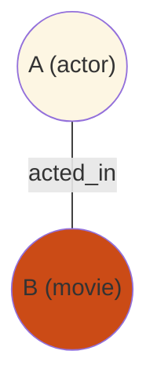

```mermaid
graph TD
  A(("A (actor)")):::t_actor
  B(("B (movie)")):::t_movie
  A ---|acted_in| B
classDef t_actor fill:#fdf6e3;
classDef t_director fill:#eee8d5;
classDef t_movie fill:#cb4b16;
classDef t_book fill:#b58900;
classDef t_default fill:#eee;
```
