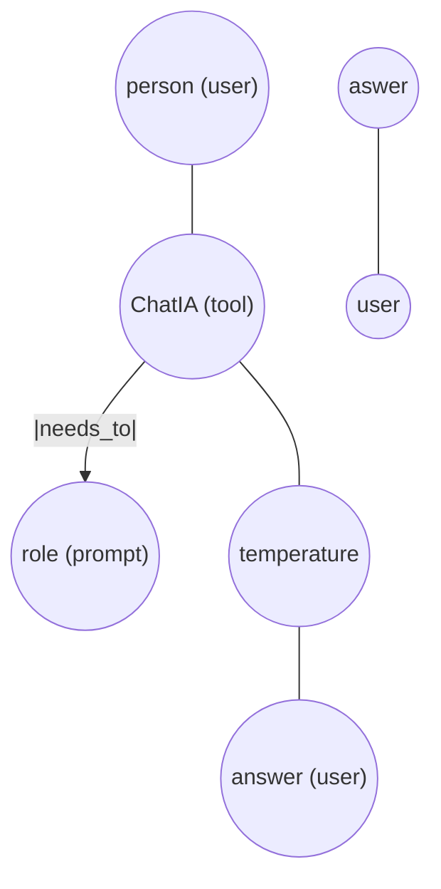

```mermaid
graph TD
  person(("person (user)")):::t_user
  ChatIA((ChatIA))
  ChatIA(("ChatIA (tool)")):::t_tool
  role(("role (prompt)")):::t_prompt
  temperature(("temperature (prompt)")):::t_prompt
  temperature((temperature))
  answer(("answer (user)")):::t_user
  aswer((aswer))
  user((user))
  person --- ChatIA
  ChatIA --|needs_to|--> role
  ChatIA --- temperature
  temperature --- answer
  aswer --- user
classDef t_actor fill:#fdf6e3;
classDef t_director fill:#eee8d5;
classDef t_movie fill:#cb4b16;
classDef t_book fill:#b58900;
classDef t_default fill:#eee;
```
