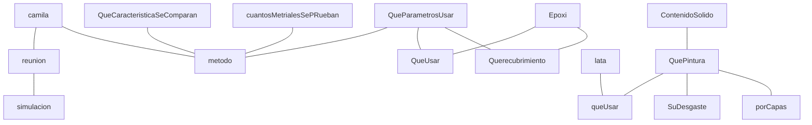

```mermaid
graph TD
  reunion
  camila
  simulacion
  metodo
  cuantosMetrialesSePRueban
  QueCaracteristicaSeComparan
  QueParametrosUsar
  Querecubrimiento
  QueUsar
  Epoxi
  queUsar
  lata
  QuePintura
  porCapas
  ContenidoSolido
  SuDesgaste

  camila --- reunion
  reunion --- simulacion
  camila --- metodo
  QueCaracteristicaSeComparan --- metodo
  QueParametrosUsar --- metodo
  cuantosMetrialesSePRueban --- metodo
  QueParametrosUsar --- QueUsar
  QueParametrosUsar --- Querecubrimiento
  Epoxi --- QueUsar
  Epoxi --- Querecubrimiento
  QuePintura --- queUsar
  lata --- queUsar
  ContenidoSolido --- QuePintura
  QuePintura --- SuDesgaste
  QuePintura --- porCapas

```
