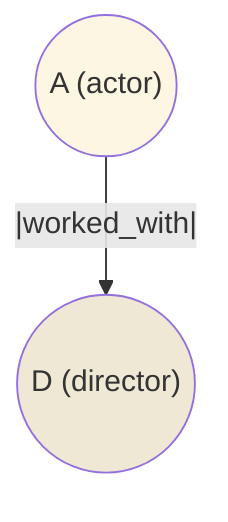

```mermaid
graph TD
  A(("A (actor)")):::t_actor
  D(("D (director)")):::t_director
  A --|worked_with|--> D
classDef t_actor fill:#fdf6e3;
classDef t_director fill:#eee8d5;
classDef t_movie fill:#cb4b16;
classDef t_book fill:#b58900;
classDef t_default fill:#eee;
```
